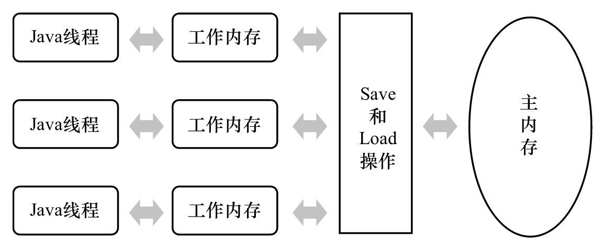
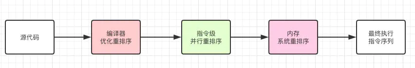
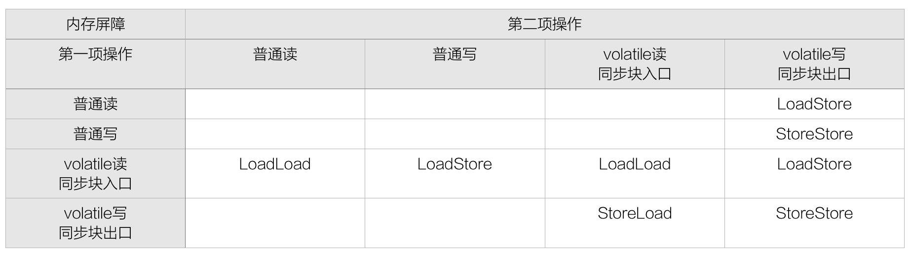

在面试过程中经常会被问到Java内存模型，那么Java的内存模型是个啥子呢？今天我们大致讲解一下基于HotSpot的内存模型，很多细节处我们需要另外展开来讨论，这里只是把基本涵盖到大致的说一下。

## Java内存模型(JavaMemoryModel)定义
描述了Java程序中各种变量在线程中的访问规则，以及在JVM中将变量，存储到内存和从内存中读取变量的底层细节。规定了所有共享实例变量，类变量都必须存储于主内存中，线程对变量的所有的读写操作都必须在自己的工作内存中完成，不能直接在主内存中操作。不同线程之间是不能直接相互访问各自工作内存中的变量。线程间变量值传递都需要主内存来完成，线程、主内存、工作内存三者的交互关系如图所示：

> 内存操作指令：
> - lock：作用于主内存的变量指令，它把一个变量标识为一个线程独占的状态；
> - unlock：作用于主内存的变量指令，它把一个处于锁定状态的变量释放出来，释放后的变量才可以被其他线程锁定；
> - read：作用于主内存的变量指令，它把一个变量的值从主内存传输到线程的工作内存中，以便随后的load指令使用。
> - load：作用于工作内存的变量指令，它把read指令从主内存中得到的变量值放入工作内存的变量副本中。
> - use：作用于工作内存的变量指令，它把工作内存中一个变量的值传递给执行引擎，每当虚拟机遇到一个需要使用到变量的值的字节码指令时将会执行这个指令。
> - assign：作用于工作内存的变量指令，它把一个从执行引擎接收到的值赋给工作内存的变量，每当虚拟机遇到一个给变量赋值的字节码指令时执行这个指令。
> - store：作用于工作内存的变量指令，它把工作内存中一个变量的值传送到主内存中，以便随后的write指令使用。
> - write：作用于主内存的变量指令，它把store指令从工作内存中得到的变量的值放入主内存的变量中。
## Java内存模型(JavaMemoryModel)三大特性
Java内存模型是围绕着在并发过程中如何处理原子性、可见性和有序性这3个特征来建立的，我们逐个来看一下哪些操作实现了这3个特性的。
### 原子性
由Java内存模型来直接保证的原子性变量指令包括 read、load、assign、use、store 和 write，我们大致可以认为基本数据类型的访问读写是具备原子性的。如果应用场景需要一个更大范围的原子性保证（经常会遇到），Java 内存模型还提供了 lock 和 unlock 指令来满足这种需求，尽管虚拟机未把 lock 和 unlock 操作直接开放给用户使用，但是却提供了更高层次的字节码指令 monitorenter 和 monitorexit 来隐式地使用这两个操作，这两个字节码指令反映到 Java 代码中就是同步块——synchronized 关键字，因此在 synchronized 块之间的操作也具备原子性。或者使用JDK的原子类
> 关于long和double变量的特殊规则:
> Java内存模型要求上面那8个缓存操作都具有原子性，但是对于64位的数据类型（long和double），在模型中特别定义了一条相对宽松的规定：允许虚拟机将没有被 volatile 修饰的64位数据的读写操作划分为两次32位的操作来进行，即允许虚拟机实现选择可以不保证64位数据类型的load、store、read 和 write 这4个操作的原子性，这点就是所谓的 long 和 double 的非原子性协定（Nonatomic Treatment ofdouble and long Variables）
### 可见性
可见性是指当一个线程修改了共享变量的值，其他线程能够立即得知这个修改。Java内存模型是通过在变量修改后将新值同步回主内存，在变量读取前从主内存刷新变量值这种依赖主内存作为传递媒介的方式来实现可见性的，无论是普通变量还是volatile变量都是如此，普通变量与 volatile 变量的区别是，volatile 的特殊规则保证了新值能立即同步到主内存，以及每次使用前立即从主内存刷新。因此，可以说 volatile 保证了多线程操作时变量的可见性，而普通变量则不能保证这一点。除了volatile我们还能使用两个关键字能实现可见性：
- synchronized：对一个变量执行unlock操作之前，必须先把此变量同步回主内存中（执行store、write操作）
- final：被final修饰的字段在构造器中一旦初始化完成，并且构造器没有把this(this引用逃逸有可能使线程通过这个引用访问到“初始化了一半”的对象，还是需要引起注意)的引用传递出去,那在其他线程中就能看见final 字段的值。

关于volatile变量在线程间可见的话是如何保证其一致性的呢？为了解决这个问题各种处理器厂商提供一些操作协议来保证数据的一致性，例如：MESI，MSI，MOSI，Synapse等。我们这里就简单说一下Inter的MESI协议吧：
#### MESI（缓存一致性协议）
当CPU写数据时，如果发现操作的变量是共享变量，即在其他CPU中也存在该变量的副本，会发出信号通知其他CPU将该变量的缓存行置为无效状态，因此当其他CPU需要读取这个变量时，发现自己缓存中缓存该变量的缓存行是无效的，那么它就会从内存重新读取。它是通过如下嗅探方式来发现数据失效的：
> 嗅探：每个处理器通过嗅探在总线上传播的数据来检查自己缓存的值是不是过期了，当处理器发现自己缓存行对应的内存地址被修改，就会将当前处理器的缓存行设置成无效状态，当处理器对这个数据进行修改操作的时候，会重新从系统内存中把数据读到处理器缓存里。如果在程序中大量使用volatile，由于Volatile的MESI缓存一致性协议，需要不断的从主内存嗅探和cas不断循环，无效交互会导致总线带宽达到峰值。这就是传说中的总线风暴。至于什么时候去使用Volatile什么时候使用锁，根据场景区分。
### 有序性
Java程序中天然的有序性可以总结为一句话：如果在本线程内观察，所有的操作都是有序的；如果在一个线程中观察另一个线程，所有的操作都是无序的。前半句是指“线程内表现为串行的语义”（Within-Thread As-If-SerialSemantics），后半句是指“指令重排序”现象和“工作内存与主内存同步延迟”现象。Java 语言提供了 volatile 和 synchronized 两个关键字来保证线程之间操作的有序性，volatile 关键字本身就包含了禁止指令重排序的语义，而 synchronized 则是由『一个变量在同一个时刻只允许一条线程对其进行lock操作』这条规则获得的，这条规则决定了持有同一个锁的两个同步块只能串行地进入。我们为什么要保证程序执行的顺序性呢？Java虚拟机在指令执行顺序方面有做了哪些规定呢？下面我们来了解下关于指令重排序。
>介绍完并发中 3 种重要的特性后,有没有朋友发现synchronized 似乎是解决以上所有问题的万金油方案吧？在大部分并发情况下都可以使用synchronized 来处理，但是在并发环境下它是强锁模式,也会伴随着很多性能问题。

#### 什么是指令重排序
为了提高性能，编译器和处理器常常会对既定的代码执行顺序进行指令重排序。那么重排序的有哪些呢？代码从编译到执行经过了多少次重排序呢？

一般重排序可以分如下三种：
1. 编译器优化的重排序：编译器在不改变单线程程序语义的前提下，可以重新安排语句的执行顺序;
2. 指令级并行的重排序：现代处理器采用了指令级并行技术来将多条指令重叠执行。如果不存在数据依赖性，处理器可以改变语句对应机器指令的执行顺序;
3.内存系统的重排序。由于处理器使用缓存和读/写缓冲区，这使得加载和存储操作看上去可能是在乱序执行的。

#### 关于指令重排序的一些规定与语义特性
##### as-if-serial
不管怎么重排序，单线程下的执行结果不能被改变。编译器、runtime和处理器都必须遵守as-if-serial语义。
##### 内存屏障
内存屏障（Memory Barrier，或有时叫做内存栅栏，Memory Fence）是一种CPU指令，用于控制特定条件下的重排序和内存可见性问题。Java编译器也会根据内存屏障的规则禁止重排序。内存屏障分为以下几种类型：
1. LoadLoad屏障：对于这样的语句Load1; LoadLoad; Load2，在Load2及后续读取操作要读取的数据被访问前，保证Load1要读取的数据被读取完毕。
2. StoreStore屏障：对于这样的语句Store1; StoreStore; Store2，在Store2及后续写入操作执行前，保证Store1的写入操作对其它处理器可见。
3. LoadStore屏障：对于这样的语句Load1; LoadStore; Store2，在Store2及后续写入操作被刷出前，保证Load1要读取的数据被读取完毕。
4. StoreLoad屏障：对于这样的语句Store1; StoreLoad; Load2，在Load2及后续所有读取操作执行前，保证Store1的写入对所有处理器可见。它的开销是四种屏障中最大的。在大多数处理器的实现中，这个屏障是个万能屏障，兼具其它三种内存屏障的功能。有的处理器的重排序规则较严，无需内存屏障也能很好的工作，Java编译器会在这种情况下不放置内存屏障。为了实现上一章中讨论的JSR-133的规定，Java编译器会这样使用内存屏障。

>在某些情况下，volatile 的同步机制的性能确实要优于锁（使用 synchronized 关键字或 java.util.concurrent 包里面的锁），但是由于虚拟机对锁实行的许多消除和优化，使得我们很难量化地认为 volatile 就会比 synchronized 快多少。如果让volatile自己与自己比较，那可以确定一个原则：volatile 变量读操作的性能消耗与普通变量几乎没有什么差别，但是写操作则可能会慢一些，因为它需要在本地代码中插入许多内存屏障指令来保证处理器不发生乱序执行。不过即便如此，大多数场景下 volatile 的总开销仍然要比锁低，我们在 volatile 与锁之中选择的唯一依据仅仅是 volatile 的语义能否满足使用场景的需求。
##### happens-before
happens-before的前后两个操作不会被重排序且后者对前者的内存可见。也就是说如果一个操作执行的结果需要对另一个操作可见，那么这两个操作之间必须存在happens-before关系。
1. 程序次序规则：线程中的每个动作 A 都 happens-before 于该线程中的每一个动作 B，其中，在程序中，所有的动作 B 都能出现在 A 之后。一段代码在单线程中执行的结果是有序的。注意是执行结果，因为虚拟机、处理器会对指令进行重排序。虽然重排序了，但是并不会影响程序的执行结果，所以程序最终执行的结果与顺序执行的结果是一致的。故而这个规则只对单线程有效，在多线程环境下无法保证正确性。
2. 监视器锁规则：对一个监视器锁的解锁 happens-before 于每一个后续对同一监视器锁的加锁。这个规则比较好理解，无论是在单线程环境还是多线程环境，一个锁处于被锁定状态，那么必须先执行unlock操作后面才能进行lock操作。
3. volatile变量规则：对 volatile 域的写入操作 happens-before 于每一个后续对同一个域的读写操作。这是一条比较重要的规则，它标志着volatile保证了线程可见性。通俗点讲就是如果一个线程先去写一个volatile变量，然后一个线程去读这个变量，那么这个写操作一定是happens-before读操作的。
4. 线程启动规则：在一个线程里，对 Thread.start 的调用会 happens-before 于每个启动线程的动作。假定线程A在执行过程中，通过执行ThreadB.start()来启动线程B，那么线程A对共享变量的修改在接下来线程B开始执行后确保对线程B可见。
5. 线程终结规则：线程中的任何动作都 happens-before 于其他线程检测到这个线程已经终结、或者从 Thread.join 调用中成功返回，或 Thread.isAlive 返回 false。假定线程A在执行的过程中，通过制定ThreadB.join()等待线程B终止，那么线程B在终止之前对共享变量的修改在线程A等待返回后可见。
6. 传递性规则：如果A happens-before B，且B happens-before C，那么A happens-before C；
7. 线程中断规则：对线程interrupt()方法的调用，happens-before于被中断线程的代码检测到中断事件的发生，可以通过Thread.interrupted()方法检测到线程是否有中断发生。
## 结尾
到这里关于Java HotSpot的内存模型基本上是说完了，其实我们就是围绕多线程的三大处理难题展开说明，以及他们背后的实现原理，很多细节地方还是需要有兴趣的朋友自己下去仔细查阅相关资料来加深理解。