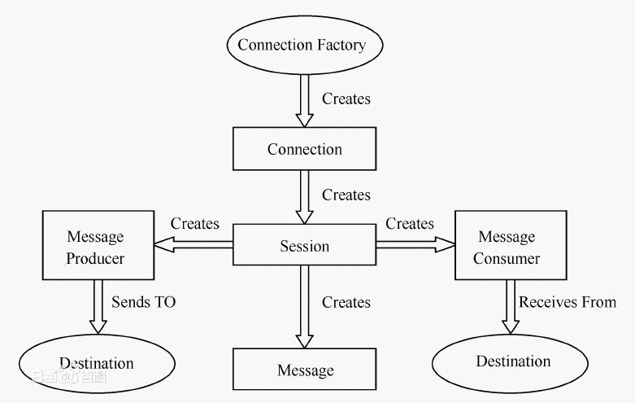
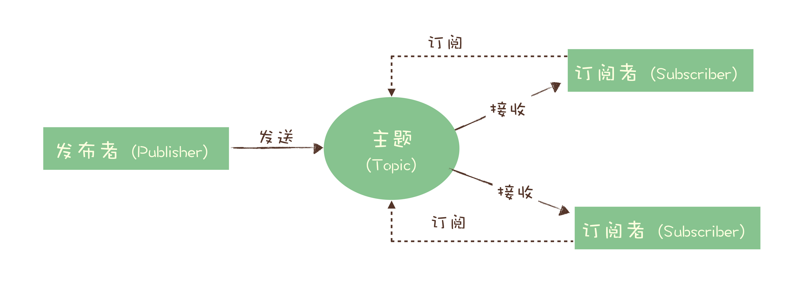
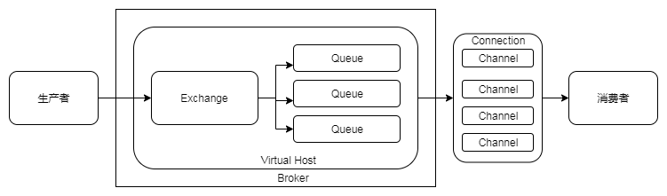
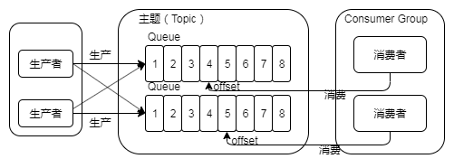
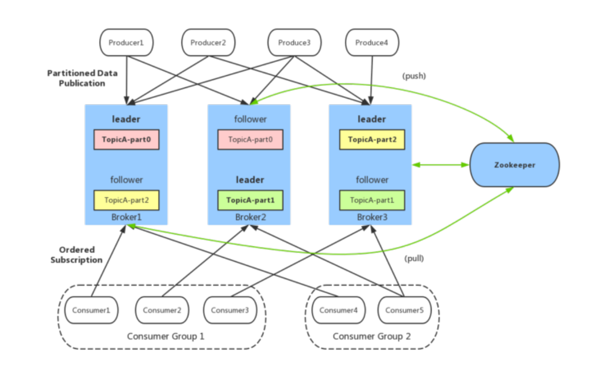

# 消息队列漫谈：什么是消息模型？
作者：阿茂

上一篇我们大致说了关于消息队列的一些特性以及适用场景，相信大家经过学习大致知道自己当下适合哪一款消息队列产品了。那么随着你了解到更多的消息队列产品的时候，很多术语名词像Queue，Exchange，Topic，Partition，Broken。。。都纷纷冒了出来，让思路逐渐清晰的你又陷入无限的思考中，它们之间到底是什么关系？它们之间又有什么区别？它们是基于什么规范提出的这一套概念？等等一系列问题。

说起这些我们不得不先说说关于消息队列的规范JMS（Java Message Service）与AMQP（Advanced Message Queuing Protocol）协议。它是早期的一些国际组织制定的一套关于消息队列实现的规范与协议。JMS是一个Java平台中关于面向消息中间件（MOM）的API，用于在两个应用程序之间，或分布式系统中发送消息，进行异步通信。

Java消息服务是一个与具体平台无关的API，它包括两种消息模式，点对点和发布者／订阅者：
- JMS点对点或队列模型：一个生产者向一个特定的队列发布消息，只有一个消费者从该队列中读取消息；生产者不需要在接收者消费该消息期间处于运行状态，接收者也同样不需要在消息发送时处于运行状态；每一个成功处理的消息都由接收者签收；多个消费者对于队列内的消息是竞争消费关系，每个消费者只能收到队列中的一部分消息。

- JMS发布者／订阅者模型：一个生产者向一个特定的队列发布消息，0个或多个订阅者可以接受来自特定消息主题的消息；发布者需要创建一个订阅主题（Topic）以便客户能够购订阅并保持持续的活动以接受消息，一个订阅主题是由至少一个队列（Queue）组成的，除非订阅者创建了持久的订阅，在订阅者未连接时发布的消息将在订阅者重新连接时重新发布，每个消费者都能收到全量的消息。

在2006年摩根大通发布了AMQP规范，它制定了消息传递方和接收方的行为，以使消息在不同的提供商之间实现互操作性，就像SMTP，HTTP，FTP等协议可以创建交互系统一样，与JMS不同的是AMQP不在关注API层面上的统一，它关注的则是关注于各种消息如何以字节流的形式进行传递，使用了符合协议实现的任意应用程序之间可以保持对消息的创建、传递。像早期的老牌消息队列AcitveMQ，它是基于JMS规范开发实现而且还支持AMQP协议的。

而随着互联网业务快速的发展，这些规范慢慢的无法满足日益繁杂的互联网架构，这时候各大厂商就纷纷出手开发出了满足自己业务领域的新的消息队列模型，逐渐抛弃了最初的规范。下面我们就还是拿现在流行的几个消息队列来举例说明
## RabbitMQ 
RabbitMQ它是一个典型的队列模型，它使用Exchange模块来保证在多消费者的模式下每个消费消费的内容是一样的。只需要根据在Exchange上配置的策略来决定将消息投递到指定的一个或者多个队列中，通过这种方式可以实现一份消息数据可以被多个订阅者来多次消费的发布/订阅者模式，这样消费者只需要关心自己消费的队列便可以了。在与消费者连接处采用的多路复用模式，这模式在之前的《单线程的Redis为什么那么快？》中有讲到，没有看过的朋友可以去翻一翻。

## RocketMQ
RocketMQ 它是一个典型的发布/订阅者模型。每个主题包含多个队列，通过多个队列来实现多实例并行生产和消费，需要注意的是他只能在队列上保证消息的有序性，主题层面却无法保证消息的顺序性。订阅者的概念是通过消费组（Consumer Group）来实现的，每个消费组都消费主题中一份完整的消息，不同消费组之间消费进度彼此不受影响，也就是说，一条消息被一个消费组消费过，也会再给另外一个消费组消费。在同一个消费组中的消费者存在消息竞争关系，每个消费只能消费消费组中的一部分消息。为了保证消息在多个消费组消费，它不会立即删除消费完的消息而是通过标记消费位置（Consumer Offset）来标记消息是否被消费过。

## Kafka 
RocketMQ与kafka的消息实现虽然不同，但是消息模型是完全一致的，kafka同样使用消费确认机制来保证数据不会再传递过程中因为各种原因导致数据的丢失，因为早期RocketMQ就是借鉴了kafka的设计理念，唯一的区别就是在kafka中一些术语名词有些不一样。在 Kafka中的队列它称之为分区（Partition）。我们来一看一下kafka的整体设计架构图

- broker：Kafka服务进程，负责消息存储和转发；
- topic：消息类别/主题，Kafka 按照 topic 来分类消息；
- partition：topic的分区，一个topic可以包含多个partition，topic消息保存在各个partition上；
- offset：消息在日志中的位置，可以理解是消息在 partition 上的偏移量，也是代表该消息的唯一序号；
- Producer：消息生产者；
- Consumer：消息消费者；
- Consumer Group：消费者分组，每个 Consumer 必须属于一个 group；
- Zookeeper：保存着集群 broker、topic、partition等meta数据（元数据）；另外，还负责broker故障发现，partition leader选举，负载均衡等功能

## 结束
这一节我们主要讲了主流的开源消息队列的消息模型以及各个消息队列中的一些术语名词，其实随着各个厂家产品发展，各自给各自的产品中一些概念命了奇怪的名字，但是他们的概念是一样的，大家碰到这些术语名字的时候不要怕，可以根据它的业务模型与运作原理可以和其他产品对比一下大致就知道它是怎么回事了。