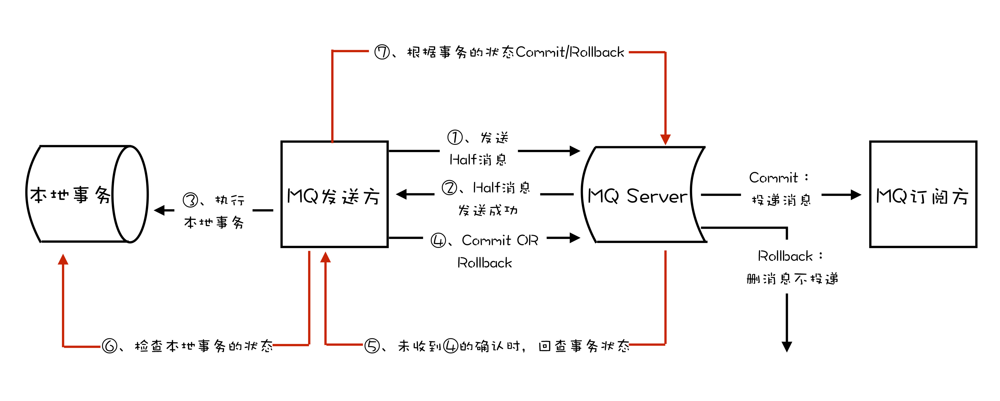
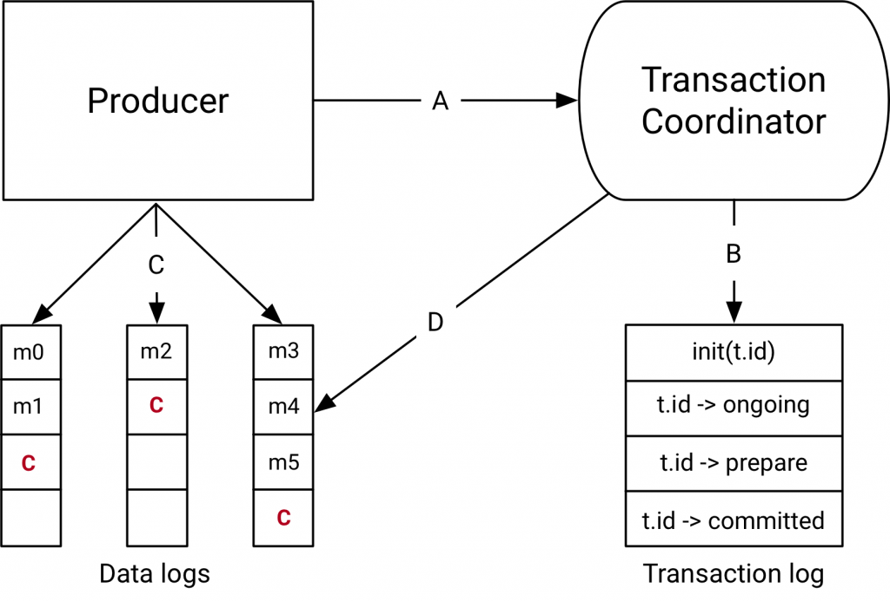

# 消息队列漫谈：如何使用消息队列实现分布式事务？
作者：阿茂

## 什么是分布式事务
说到事务，我们不得不又说到传统关系型数据库的事务，一个标准的事务应该具备四个特性：原子性、一致性、隔离性、持久性，就是我们经常说到的ACID。我们来看下维基百科上是怎么定义的：
- 原子性（Atomicity）：事务作为一个整体被执行，包含在其中的对数据库的操作要么全部被执行，要么都不执行。
- 一致性（Consistency）：事务应确保数据库的状态从一个一致状态转变为另一个一致状态。一致状态的含义是数据库中的数据应满足完整性约束。
- 隔离性（Isolation）：多个事务并发执行时，一个事务的执行不应影响其他事务的执行。
- 持久性（Durability）：已被提交的事务对数据库的修改应该永久保存在数据库中。

但是在分布式事系统中想同时满足这四个特性是比较困难的，即使实现了，这个系统的的性能我们也是不能接受的。你想想这么多年大家一直都在为探索分布式系统保证可用性的同时的数据一致性做出多少努力，最终产生了很多妥协版本：最终一致性，顺序一致性等。到目前为止像我们常见的：二阶段提交，TCC和我们下面将说到的事务消息，没有哪一个能够给出完美且通用的分布式事务解决方案，仅根据特定的场景解决了一些特定的业务而已，所以大家出去面试的时候吹这块的时候，自己心里要有个数。

## 基于消息队列的分布式事务
上面说到不是每一个分布式事务解决方案都是完美的，那么我们这里说到的消息事务也是一样的，它主要处理异步数据，因为异步的关系会有一定的延迟导致数据的不一致，但是最终是一致的。我们来看一下在两个支持事务消息的消息系统RocketMQ ，kafka（0.11后版本）是怎么实现的：
### RocketMQ事务原理

1. 在消息队列上开启一个事务主题。
2. 事务中第一个执行的服务发送一条“半消息”（半消息和普通消息的唯一区别是，在事务提交之前，对于消费者来说，这个消息是不可见的）给消息队列。
3. 半消息发送成功后，发送半消息的服务就会开始执行本地事务，根据本地事务执行结果来决定事务消息提交或者回滚，RocketMQ提供事务反查来解决异常情况，如果RocketMQ没有收到提交或者回滚的请求，Broker会定时到生产者上去反查本地事务的状态，然后根据生产者本地事务的状态来处理这个“半消息”是提交还是回滚。值得注意的是我们需要根据自己的业逻辑来实现反查逻辑接口，然后根据返回值Broken自己做提交或者回滚，而且这个反查接口已经做到了无状态的，请求到任意一个生产者节点都会返回正确的数据。
4. 本地事务成功后会让这个“半消息”变成正常消息，供分布式事务后面的步骤执行自己的本地事务。（这里的事务消息，producer不会因为consumer消费失败而做回滚，采用事务消息的应用，其所追求的是高可用和最终一致性，消息消费失败的话，MQ自己会负责重推消息，直到消费成功。当然如果你可以根据自己业务来反向操作）。
### kafka事务原理
我们先来看以下kafka官网事务实现原理的图：

kafka事务也是基于二阶段提交来实现的，但是它在其中加入了一个事务协调者的概念，事务协调者并不是独立的应用，它是Broken的一部分，协调者也是需要ZooKeeper来保证其可用性的，为了提高并行性能kafka允许多个协调者分别负责管理事务主题中的不同的分区。下面我们大概介绍下图上的流程
1. 开启事务，生产者发送给协调者一个事务开启请求，协调者在事务日志中创建一个事务ID并记录。
2. 生产者发消息之前给协调者发送消息定位通知（发送的消息属于哪个主题和分区），协调者记录消息定位消息。
3. 生产者将一些真正的业务消息给对应分区的Broken，kafka客户端会自动过滤未提交的事务消息。
4. 生产者发送消息后，生产者给协调者发送提交或者回滚事务的请求。协调者根据结果将事务状态设置为回滚或者预提交状态，并写入日志。
5. 协调者在事务相关的所有分区中写入一条“事务结束”的消息，当消费者受到这个消息时候，就可以把之前那些过滤掉未提交的消息放开给消费者消费，协调者记录日志，事务结束。

再这里我们来总结下这块知识点面试的人会经常问的问题：

Q：如果你当前使用的消息队列不支持“半消息/预发消息”怎么做？

A： 可以使用关系型数据库的一行记录来记录本地事务，使用状态列来表示本地事务执行的结果，通过异步线程不断捞出本地事务执行成功的消息发生到MQ中。

---
Q：为什么要增加一个消息预发送机制，增加两次发布出去消息的重试机制，为什么不在业务成功之后，发送失败的话使用一次重试机制？

A：如果业务执行成功，再去发消息，此时如果还没来得及发消息，业务系统就已经宕机了，系统重启后，根本没有记录之前是否发送过消息，这样就会导致业务执行成功，消息最终没发出去的情况。

---

Q：如果consumer端因为业务异常而导致回滚，那么岂不是两边最终无法保证一致性?

A：我们上面提到过在分布式事务中只允许系统异常失败，不允许业务异常失败。我们可以通过重试来实现最终一致性，或者通过监控差错系统来单独处理这类问题。两阶段提交的方式是不适合强一致性的业务场景。

---
Q：kafka事务消息和RocketMQ事务消息的区别？

A：它们实用的场景是不一样的，RocketMQ中的事务，它解决的问题是，确保执行本地事务和发消息这两个操作，要么都成功，要么都失败。并且RocketMQ增加了一个事务反查的机制，来尽量提高事务执行的成功率和数据一致性。 Kafka 中的事务，它解决的问题是，确保在一个事务中发送的多条消息，要么都成功，要么都失败。（这里面的多条消息不一定要在同一个主题和分区中，可以是发往多个主题和分区的消息）当然也可以在kafka事务执行过程中开启本地事务来实现类似RocketMQ事务消息的效果，但是Kafka是没有事务消息反查机制的，它是直接抛出异常的，用户可以根据异常来实现自己的重试等方法保证事务正常运行。

---
Q：kafka的Exactly Once语义怎么理解？

A:一般情况下我能使用kafka事务消息配合幂等机制来实现Exactly Once（仅且一次），这里的Exactly Once和消息对列服务中的“仅且一次”概念是完全不一样的。在消息队列的“仅且一次”是指从生产者发送消息到Broker，再到消费者消费到消息仅且一次。而kafka中的Exactly Once它解决的是在流计算中kafka作为数据源并将计算结果保存到kafka中的这个过程，保证每条消息都仅且一次被计算过。

## 总结
这一篇我们讲了RocketMQ 与Kafka是如何来实现事务的，它们的共同点就是：都是通过两阶段提交来实现事务的，事务消息都保存在单独的主题上。不同的地方就是RocketMQ是通过“半消息”来实现的，kafka是直接将消息发送给对应的topic，通过客户端来过滤实现的。而且它们两个使用的场景区别是非常之大的，RockteMQ主要解决的是基于本地事务和消息的数据一致性，而Kafka的事务则是用于实现它的Exactly Once机制，应用于实时流计算的场景中。今天关于消息队列的事务实现就到这里，大家要是喜欢的话请帮转起来，有问题留言给我，很高兴与大家一起探讨，谢谢。

    

