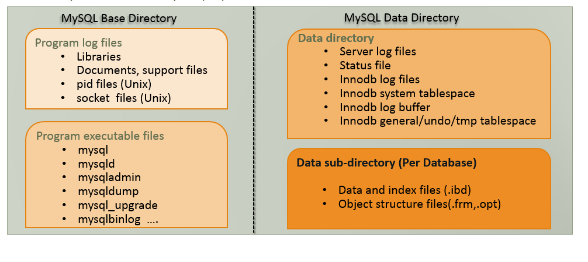
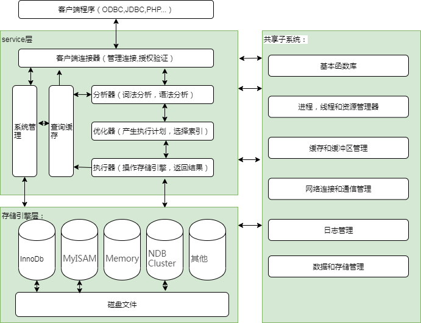

#MySql那些事儿（一）：MySql架构介绍
作者：阿茂

从今天开始我们就说说MySql那些事儿，看我标题就能知道这不是一两句话能说清楚的，那么各位看官慢看听我道来：
那些MySql的起源与发展历程还有和他东家们的那些事儿，以及和那些关系数据库兄弟们的爱恨情仇我这里就不说了，
留给各位自行搜索（大家要是有兴趣回头补一篇前传），我们直接上干货。

### MySql物理架构：

>本图是基于MySql5.7 版本InnoDB存储引擎。基础和数据目录的概述。位置取决于安装，使用的操作系统和数据存储。

### MySql逻辑架构：

很难在有限的篇幅解释清楚所有的mysql组件，这里我们就只讨论一些核心组件：
#### Service层
- 客户端连接器：也称之为mysql应用层。主要负责：
  - 连接处理：当客户端请求上来mysql会从线程池分配一个线程来与客户端连接，如果连接处于空闲状态， wait_timeout参数决定断开时间；
  - 用户鉴权：是通过用户名，客户端地址，密码的方式来鉴权用户；
  - 安全管理：mysql通过连接的权限来控制连接可以执行哪些操作；
  - 查询缓存：之前执行过的语句与结果是以K-V方式保存在查询缓存中，查询请求如果命中直接返回，查询结束。查询缓存失效非常频繁，
  只要对一张表进行更新，那么它所对应的的查询缓存都会被清空。query_cache_type参数来设置是否使用查询缓存，8.0以后的版本直接废弃查询缓存。
  - 分析器/解析器：如果没有命中查询缓存，将会进入分析器。先开始做词法分析解析出表名，函数，关键字等，然后开始校验语法分析，校验语法的正确性，我们常看到的：You have an error in your SQL syntax...的错误提示就是从这里返回的。一般语法错误会提示第一个出现错误的位置，依次类推。
   - 优化器：经过分析器，SQL有多张表关联或者有多个索引的时候，优化器是根据索引来决定表的顺序与条件顺序。你写的SQL语句没有强行设置执行顺序的话，可能不是你想要的条件执行顺序，后面我会专门来说优化器对索引的选择算法。
  - 执行器：经过优化的SQL重写以后，执行器会先判断线程有没有数据的读写权限，如果有将打开表继续执行。执行器会根据不同存储引擎接口来调用api实现，根据索引规则来对表进行扫描，返回结果。如果表或者列不存在就会看到：Table doesn't exist，Unknown column where clause这样的提示。
  - MySql管理系统（MySQL Management Server & utilities）：提供了丰富的数据库管理功能，例如：数据库备份和恢复，数据库安全管理与权限管理，数据库复制管理，集群管理，数据库元数据管理，分库分别管理等。

#### 存储引擎层：
- 存储引擎：一种管理物理数据和位置的插件类组件，负责执行sql语句并从磁盘文件中获取数据。
- 磁盘文件：包括redolog、undolog、binlog、errorlog、querylog、slowlog、data、index等。

#### 核心子系统： 
-基本函数库子系统：在所有mysql子系统之间共享的一组通用函数。
-进程，线程和资源管理子系统：基于线程资源的管理服务器体系结构。
-缓存和缓冲区管理子系统：提高查询速度,减少IO次数的检索方式。私有会话级别与实例共享级别。
-网络连接与通信管理系统：维护这全部的会话连接与通信。
-日志管理子系统：管理所有的mysql日志，数据日志，操作日志，慢查询日志，访问日志等。
-数据和存储管理子系统：管理数据文件与存储方式，存储格式，存储位置。

参考资料：
> MySQL Architecture and Components :`https://lalitvc.wordpress.com/2016/11/03/mysql-architecture-and-components/`

