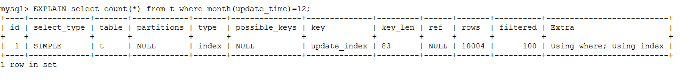
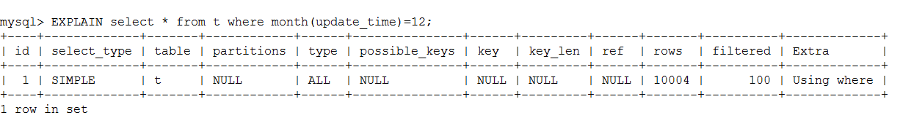
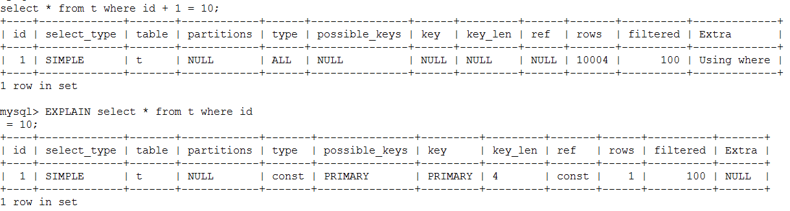

# MySql那些事儿（七）：索引失效案例分析
作者：阿茂

我们在第四篇讲了索引原理，这一篇我们列举一些索引失效的场景，谈谈平时大家都不太注意的一些细节问题：

## 索引条件使用函数操作或运算
看到这个标题有的哥们就说了：这个我知道，给索引条件加函数Mysql不会走索引。那么是为什么呢？我们来分析一下，将第五章的建表语句稍微改动下：
```mysql
CREATE TABLE `t` (
  `id` int(11) NOT NULL,
  `city` varchar(16)  NOT NULL,
  `name` varchar(16)  NOT NULL,
  `age` int(11) NOT NULL,
  `addr` varchar(128)  DEFAULT NULL,
  `update_time` varchar(20)  DEFAULT NULL,
  PRIMARY KEY (`id`),
  KEY `update_index` (`update_time`) USING BTREE
) ENGINE=InnoDB DEFAULT CHARSET=utf8mb4 COLLATE=utf8mb4_bin;
```
>添加update_time字段 ，并给此字段添加索引

现在我们要统计12月的记录一共有多少条记录SQL语句如下：
```mysql
select count(*) from t where month(creat_time)=12;
```


看运行结果竟然用到了update_index这个索引，惊奇不惊奇，意外不意外？然后我们再细分析一下，实际上这个函数已经破坏了索引的原本的结构，在这种情况下SQL优化器可以选择唯一索引，也可以选择索引update_index，然鹅优化器在经过一系列运算后发现还是用update_index划算，那么他就还是走了update_index。但是我们看一下执行计划的rows是10004条（本表一共有10000条记录，满足条件的有9000多条），也就是说虽然走了update_index索引，却走了全表扫描(这就论证了，业内所传的函数条件导致不走索引的结论不是很严谨，哈哈哈...）。再看看我们使用这样一条SQL的执行计划：
```mysql
EXPLAIN select * from t where month(update_time)=12;
```


当需要查询非索引字段时Mysql果断放弃了update_index而使用了全表扫描。

说完函数我们说说索引条件的运算，这个就比较好理解的了，举个例子：
```mysql
select * from t where id + 1 = 10
```
这个条件并不会破坏索引原有结构的有序性，但是Mysql还是不能通过索引一次性找到这条记录，需要扫描全表



## 隐式转换
我们这里抛出一个sql大家猜猜看看是什么结果就知道了：
```mysql
select “10” > 9
```
我这里就不截图了，它查询结果是1，也就是说MySQL中，字符串和数字做比较的话，是将字符串转换成数字。那么它的执行SQL是这样的：
```mysql
select CAST("10" AS signed int) > 9
```
假如我们将这种使用方式在where条件中，就会破坏到当前条件索引，平时在写sql时注意：一般都是宽类型向窄类型转换，尽量将需要转换的类型放在表达式后面。
## 隐式字符编码转换
这里大家需要注意的是：多表关联查询时，被驱动的表的关联索引字段会加上字符转换函数CONVERT()，又会导致全表扫描。
