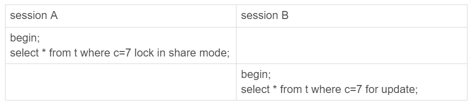

# MySql那些事儿（五）：事务是个什么东西？
作者：阿茂

上一篇文章我们说了索引，收到有些朋友的提问，其中有这么一个问题：datetime类型的数据列索引怎么创建？我们在这里简单的说一下吧，因为datetime类型的类索引处理确实是注意下，我就说几种方式吧。最优处理办法就是把传入的datetime值转换成整型去和数据库列作比较。这样的就需要程序里面做一次转换，还有一只就是直接用时间字符串比较‘2019-11-01 13:05:13’，使用FROM_UNIXTIME()函数却是里面最慢的一种方式。大家可以去试试。还有一种就是在index(dateTime)的索引上添加函数，让它索引按字符串创建例如可以这样convert(ndex(dateTime),'partten')去创建索引。就和其他索引的使用方式一样了。好了上回内容就说道这，大家有什么问题或者好的想法可以私信或者留言给我，我会尽全力回答。

这篇文章我们说下事务，简单的说就是保障一组数据库操作要么一起成功，要么一起失败的机制。最经典的例子就是银行转账操作，既要保证转账人账户和收款人账户正确还要保证银行流水完整，交易可以回溯，其中环节缺一不可。事务的支持是在数据库引擎层面的，并不是所有的引擎对事务都有良好的支持。比如MyISAM,Memory。那么它是通过什么样的设计来保证的呢？（这里说个题外话，希望大家多看看原理性的东西，最终看下来你会发现现在很多中间件，这框架，那框架底层设计算法都是大同小异）
### 事务的工作原理
InnoDB的为了支持事务而单独引入了undo log和redo log两个概念来实现事务的回滚和写入，保证事务的一致性。redo log为了提高吞吐量还提供了纯内存的redo log buffer操作，这个我们在Mysql逻辑架构的时候已经说过了，不在复述。下面具体看这两好基友怎么配合保证事务的正确性的。
#### redo log原理
InnoDB是采用Write Ahead Log策略（先写日志再写磁盘），当一条记录写入是，它会先写入redo log buffer的内存中，我们可以手动设置刷盘参数innodb_flush_log_at_trx_commit，将redo log buffer的内容通过后台线程更新到redo log file中去。redo log是固定大小，固定数量循环写入的一个闭环，通过checkpoint值往前推进，当写到结尾时，将头部的文件刷到磁盘后重新开始写入，异常重启后根据checkpoint可以继续将赃页刷新到磁盘。 可以通过参数innodb_log_files_in_group 和 innodb_log_file_size 配置日志文件数量和每个日志文件的大小。偶尔我们会发现某个时段Mysql服务器好像卡了一下，大概率的就是在刷赃页到数据库。
> innodb_flush_log_at_trx_commit参数说明
> - 0:表示每次事务提交时都只是把redo log留在redo log buffer中。
> - 1:表示每次事务提交时都将redo log直接持久化到磁盘。
> - 2:表示每次事务提交时都只是把redo log写到System page cache。

Buffer pool中的内容页跟磁盘页的内容不一致我就称之为赃页。实际上除了后台线程轮询刷新还有几个场景场景会将脏页刷新到磁盘，其中前两种情况会将一个未提交事务写入磁盘：
> - redo log buffer占用的空间即将达到 innodb_log_buffer_size一半的时候，后台线程会主动将数据写到System cache
> - 并行的事务提交的时候，会一起将事务的redo log buffer持久化到磁盘。（就是上面说到的innodb_flush_log_at_trx_commit参数为1的时候）
> - Mysql进程正常关闭或者空闲的时候
####undo log 原理
看完redo log是怎么提交写入数据的，我们现在再来看看undo log是怎么将数据回滚的。InnoDB采用回滚段的方式来维护undo log的并发写入和持久化。回滚段实际上是一种 Undo 文件组织方式，每个回滚段又有多个undo log slot。当每启动一个事务的时候都会分配一个transaction id赋给这个事务，记为row trx_id，同时将旧的数据版本保留在undo log中，当发生回滚时就能拿到旧数据版本。也就说一行数据在某时刻可能有多个版本，每个版本都有自己的row trx_id。当事务提交后就不在需要之部分日志。
- insert undo log：会记录一种TRX_UNDO_INSERT_REC的日志，内容包括undo type、undo no、table id、主键各列信息<len,value>列表等,len 表示所占长度，我们往表里插入一条数据会同时插入主键索引和二级索引，在回滚时页应当删掉。我们偶尔会看到某行数据的三个隐式列：row_id、trx_id、roll_pointer前面两个大家应该都不陌生，最后这个就是指向的undo log的指针。
- delete undo log：Buffer Pool的数据页中的记录会根据记录头信息中的 next_record 属性组成一个单向链表  。当删除记录的时候，这些记录也会根据记录头信息中的 next_record 属性组成一个新的单向链表，我们称之为垃圾链表。Page Header 部分有一个称之为 page_free 的属性，它指向该垃圾链表中的头节点。当我们删除一条记录时其实是分两个阶段的
  - 第一阶段delete mark：仅仅将记录的 delete_mark 标识位设置为 1，不会将该记录移动到垃圾链表。在删除语句所在的事务提交之前，被删除的记录一直都处于这种状态。
  - 第二阶段purge ：当该删除语句所在的事务提交之后，会有专门的线程（ purge thread ）来真正的把记录删除掉。真正的删除也就是把记录移动到垃圾链表（头插法，所以会涉及到 PAGE_FREE 的修改），并且修改诸如页面用户记录数量、上次插入记录位置等信息。
 > 阶段二是在事务提交后执行的，所以不考虑回滚。这里只考虑对阶段一所做操作进行回滚。InnoDB 设计了一种 TRX_UNDO_DEL_MARK_REC 类型的 undo 日志。它存储的信息比TRX_UNDO_INSERT_REC（插入undo log）多了几个属性：old trx_id（旧事务id），old roll_pointer（旧回滚指针），索引列各列信息
 - update undo log：在使用 update 更新数据时，可以分为不更新主键和更新主键两种情况
   - 不更新主键：任意一个被更新的列，更新前后占用存储空间发生了变化，那么就不能直接在原记录上直接修改。而是需要先在聚簇索引中将该记录删除，再根据更新后的值创建一条新的记录插入。（这里所说的删除不是上面说的 delete mark，而是由用户线程同步执行的真正删除）,不更新主键undo log类型为：TRX_UNDO_UPD_EXIST_REC ，它比TRX_UNDO_DEL_MARK_REC（delete mark 日志）多了存储了：n_updated（多少个列被更新），被更新列更新前信息，索引列各列信息 （有的索引的话）。
   - 更新主键：其实就是TRX_UNDO_DEL_MARK_REC(删除)+TRX_UNDO_INSERT_REC(插入)两条操作日志。
### 事务的隔离级别
说到隔离级别，是不是又是一种面试的既视感面试官问：“请你说说事务吧？”，然后你就说：“事务有四个特性：ACID（Atomicity、Consistency、Isolation、Durability，即原子性、一致性、隔离性、持久性）”，然后你有接着说：“SQL标准的事务隔离级别包括：读未提交（read uncommitted）,可能发生脏读、不可重复读和幻读、读提交（read committed）可能发生不可重复读和幻读、可重复读（repeatable read）可能发生幻读和串行化（serializable ）。”，面试官说：“完了？”。你又望着面试官，面试官望着你。然后面试官说：“那我们的今天面试就到这里吧，你有什么想问我的？”，你满脸问号？？？什么情况？？？有没有遇到过？你说的没有问题都是对的，那么你知道的点，刚毕业的萌新对这样的问题也能给出同样 的答案，怎么区分你的能力所在呢？要说就说点别人不知道的，核心的，底层的：
#### ReadView
前面说到记录的回滚指针 roll_pointer 指向 undo log，会形成一个版本链，事务在读取记录时在不同的隔离级别下可能会看到不同的记录版本。这个功能通过 ReadView 来实现。ReadView 主要包含以下几个部分：
-  m_ids：生成 ReadView 时系统中活跃的事务 id 集合
-  min_trx_id：生成 ReadView 时系统中活跃的最小事务 id，也就是 m_ids 中的最小值
-  max_trx_id：生成 ReadView 时系统中应该分配给下一个事务的 id 值，比 m_ids 的最大值要大
-  creator_trx_id：生成该 ReadView 的事务 id
> 由于读未提交级别下每次读取最新记录，串行化级别下通过加锁访问数据，所以 ReadView仅对读已提交 和可重复读有效。

怎么通过这个 ReadView 来判别当前事务能看到的版本呢？这里总结如下：一个数据版本，对于一个ReadView来说，除了自己的更新总是可见以外，有三种情况：
1. 版本未提交，不可见；
2. 版本已提交，但是是在视图创建后提交的，不可见（trx_id >max_trx_id）；
3. 版本已提交，而且是在视图创建前提交的，可见（trx_id <min_trx_id ）。
4. 版本不管提交未提交，它自己修改的数据总是可见的（trx_id =creator_trx_id ）

如果某个版本的数据对当前事务不可见的话，那就顺着版本链找到下一个版本的数据，继续按照上边的步骤判断可见性，依此类推，直到版本链中的最后一个版本。上面所说的就MySQL中鼎鼎大名的“当前读”概念。read committed是每次读取数据前都生成一个ReadView，不能保证可重复读。repeatable read在第一次读取数据时生成一个ReadView，能够保证可重复读。

#### 幻读
在repeatable read级别下，会在第一次读取数据时就生成一个 ReadView，所以可以保证可重复读。可是他能否解决幻读呢？我们要通过间隙锁(Gap Lock)来解决RR级别下幻读问题。顾名思义，间隙锁，锁的就是两个值之间的空隙。我们在这里初始化一张表
```mysql
CREATE TABLE `t` (
  `id` int(11) NOT NULL,
  `c` int(11) DEFAULT NULL,
  `d` int(11) DEFAULT NULL,
  PRIMARY KEY (`id`),
  KEY `c` (`c`)
) ENGINE=InnoDB;

insert into t values(0,0,0),(5,5,5),(10,10,10),(15,15,15),(20,20,20),(25,25,25);
```
初始化插入了6个记录，这就产生了7个间隙。这样，当你执行 select * from t where d=5 for update的时候，就不止是给数据库中已有的6个记录加上了行锁，还同时加了7个间隙锁。这样就确保了无法再插入新的记录。也就是说这时候，在一行行扫描的过程中，不仅将给行加上了行锁，还给行两边的空隙，也加上了间隙锁。现在你知道了，数据行是可以加上锁的实体，数据行之间的间隙，也是可以加上锁的实体。但是间隙锁跟我们之前碰到过的锁都不太一样。比如行锁，分成读锁和写锁。下图就是这两种类型行锁的冲突关系。

| |读锁|写锁|
|----|----|----|
|写锁|兼容|冲突|
写锁|冲突|冲突|

也就是说，跟行锁有冲突关系的是“另外一个行锁”。但是间隙锁不一样，跟间隙锁存在冲突关系的，是“往这个间隙中插入一个记录”这个操作。间隙锁之间都不存在冲突关系。这句话不太好理解，我给你举个例子：



这里session B并不会被堵住。因为表t里并没有c=7这个记录，因此session A加的是间隙锁(5,10)。而session B也是在这个间隙加的间隙锁。它们有共同的目标，即：保护这个间隙，不允许插入值。但，它们之间是不冲突的。间隙锁和行锁合称next-key lock，每个next-key lock是前开后闭区间。也就是说，我们的表t初始化以后，如果用select * from t for update要把整个表所有记录锁起来，就形成了7个next-key lock，分别是 (-∞,0]、(0,5]、(5,10]、(10,15]、(15,20]、(20, 25]、(25, +supremum]。间隙锁的引入解决了幻读问题，但是会导致同样的语句锁住更大的范围，这其实是影响了并发度的。最终还是要根据场景来使用。

### 结尾
今天事务的相关内容就讲到完了，到这里我们算是大体上把mysql一些重要基础概念了。下面我们列举一些场景，说说具体在实际中的操作。要是文章对你有帮助请分享给别的小伙伴，谢谢大家。


