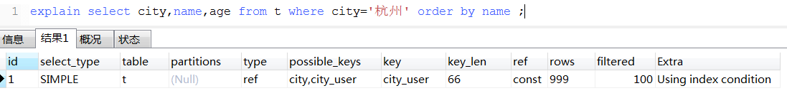

#MySql那些事儿（六）：你知道order by是怎么排序的吗？
作者：阿茂

从这一片开始我们就说一下平时是遇到的问题以及其原理解析，看到标题有没有朋友遇到过sql加了order by速度很慢的呢？下面我们来看了例子，建表语句入下：
```mysql
CREATE TABLE `t` (
  `id` int(11) NOT NULL,
  `city` varchar(16) NOT NULL,
  `name` varchar(16) NOT NULL,
  `age` int(11) NOT NULL,
  `addr` varchar(128) DEFAULT NULL,
  PRIMARY KEY (`id`),
  KEY `city` (`city`)
) ENGINE=InnoDB;
```
我们的排序语句入下
```mysql
select city,name,age from t where city='杭州' order by name ;
```
##全字段排序
作为一个优秀的crud程序员，为了避免全部扫描我们都会在city字段上建立索引，然后我们用explain来看看我们的执行计划

 
 
 Extra这个字段中的“Using filesort”表示的就是需要排序，MySQL会给每个线程分配一块内存用于排序，称为sort_buffer。
 下面我们梳理下执行流程
 > 1. 初始化sort_buffer，确定放入name、city、age这三个字段；
 > 2. 从索引city找到第一个满足city='杭州’条件的主键id；
 > 3. 到主键id索引取出整行，取name、city、age三个字段的值，存入sort_buffer中；
 > 4. 从索引city取下一个记录的主键id；
 > 5. 重复步骤3、4直到city的值不满足查询条件为止；
 > 6. 对sort_buffer中的数据按照字段name做快速排序；
 > 7. 返回结果集给客户端
 
“按name排序”这个动作，可能在内存中完成，也可能需要使用外部排序，这取决于排序所需的内存和参数sort_buffer_size。它就是MySQL为排序开辟的内存（sort_buffer）的大小。如果要排序的数据量小于sort_buffer_size，排序就在内存中完成。但如果排序数据量太大，内存放不下，则不得不利用产生的临时文件，需要利用归并排序算法，保证临时文件中记录是有序的。对应第三步MySQL本身一个优化，即在捞之前首先将id排序，并放入缓冲区，这个缓存区大小由参数read_rnd_buffer_size控制，然后有序去捞记录，将随机IO转为顺序IO。
>归并排序：
>归并排序 (merge sort) 是一类与插入排序、交换排序、选择排序不同的另一种排序方法。归并的含义是将两个或两个以上的有序表合并成一个新的有序表。(有兴趣可以Google以下，我们这里就不详细解说了，否则就讲劈叉了)

## rowid排序
通过上面的例子大家都应该能看的出来，当查询行的数据量很大的时候，需要每次都都要从查询出来的数据放到sort_buffer中，这样内存中只能放下有限数量的数据，要分很多的临时文件用来辅助排序，性能就会很差。总结下来就是：当查询单行数据量较大的时候这个方法就不说最优选择。那么用什么方式呢？这就不得不说到max_length_for_sort_data 这个参数了
>max_length_for_sort_data：MySQL中专门控制用于排序的行数据的长度的一个参数。如果单行的长度超过这个值，MySQL就认为单行太大，要换一个算法。

city ->varchar(16)、name -> varchar(16) 、age ->int(11) 这三个字段的定义总长度是43，我把max_length_for_sort_data设置为16，我们再来看看计算过程有什么改变 :新的算法放入sort_buffer的字段，只有要排序的列（即name字段）和主键id。排序的结果就因为少了city和age字段的值，不能直接返回了，整个执行流程就变成如下所示的样子：
> 1. 初始化sort_buffer，确定放入两个字段，即name和id；
> 2. 从索引city找到第一个满足city='杭州’条件的主键id；
> 3. 到主键id索引取出整行，取name、id这两个字段，存入sort_buffer中；
> 4. 从索引city取下一个记录的主键id；
> 5. 重复步骤3、4直到不满足city='杭州’条件为止;
> 6. 对sort_buffer中的数据按照字段name进行排序；
> 7. <font color=#FF0000 > 按照id的值回到原表中取出city、name和age三个字段返回给客户端结果集。</font>

全字段排序算法中你会发现，rowid排序多访问了一次表t的主键索引。需要说明的是，最后的“结果集”是一个逻辑概念，实际上MySQL服务端从排序后的sort_buffer中依次取出id，然后到原表查到city、name和age这三个字段的结果，不需要在服务端再耗费内存存储结果，是直接返回给客户端的。
## 优先队列排序
5.6版本后针对Order by limit M，N语句，在空间层面做了优化，加入了一种新的排序方式--优先队列，这种方式采用堆排序实现。堆排序算法特征正好可以解limit M，N 这类排序的问题，虽然仍然需要所有元素参与排序，但是只需要M+N个元组的sort buffer空间即可，对于M，N很小的场景，基本不会因为sort buffer不够而导致需要临时文件进行归并排序的问题。对于升序，采用大顶堆，最终堆中的元素组成了最小的N个元素，对于降序，采用小顶堆，最终堆中的元素组成了最大的N的元素。
## 总结
花开两朵个表一只，这两种排序并没有什么优劣，就看你怎么根据实际情况来选择。mysql想告诉我们的是：如果内存够，就要多利用内存，尽量减少磁盘访问。像我们上面那个rowid排序的例子，还要在多回表一次取到name字段，如果是覆盖索引的话就会少一次回表。我们在设计索引和写sql的时候脑子里面预先过一遍，记住这一条规则。然鹅。。。并不是所有的order by都需要排序，对并是不所有的order by都需要排序,你没听错！为什么呢？我们先抛出一个假设：假设我们按照city这个索引取出的行，先天就是按照name字段排序的呢？是不是就不需要排序了呢？只要要这个假设成立我们不就不用排序了吗。我们创建一个组合索引index_user（city, name）:
```mysql
alter table t add index city_user(city, name);
```
在这个索引里面，我们依然可以用树搜索的方式定位到第一个满足city='杭州’的记录，并且额外确保了，接下来按顺序取“下一条记录”的遍历过程中，只要city的值是杭州，name的值就一定是有序的。我们来分析下sql执行
> 1. 从索引(city,name)找到第一个满足city='杭州’条件的主键id；
> 2. 到主键id索引取出整行，取name、city、age三个字段的值，作为结果集的一部分直接返回；
> 3. 从索引(city,name)取下一个满足条件记录主键id；
> 4. 重复步骤2、3，直到条件不满足，返回结果集。

为了保证我们的所分析的，我用explain来印证下我们的假设。



神奇的Using filesort不见了看到了没，也就是不需要排序了。由于(city,name)这个联合索引本身有序，只要查出所需数据就返回。那么这个sql还能减少内存操作吗？答案是肯定的，因为上面的联合索引中不包含age字段所有需要回表找到age字段再返回，我们把age也加到这个联合index中的话直接就冲二级索引树中拿到数据直接返回，不需要通过id回表找到整行记录。

到此为止我们我们也基本了解到了mysql的一些主要排序方式与sort_buffer的介绍，相信大家对order by子句一下子豁然开朗了吧。没事自己多看看，多想想。学使用explain和optimize trace这两个利器，找出sql的问题所在。好了本节内容我们就说完了，喜欢的请点下右下边的“在看”，或者分享给你的朋友们。文中有错误或者你对本文有疑问的地方很欢迎私信我。


参考资料：
>‘https://time.geekbang.org/column/intro/139’