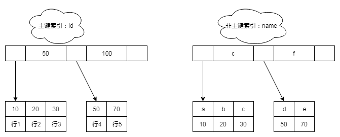

# 吃透索引
作者：阿茂

上回我们说完了InnoDB的架构以及设计原理，现在我们来说一说索引。索引说起来大家应该都不陌生，有没有一种即视感，运维同学在群里甩了一个sql说查询非常慢让开发的同学认领，然后你看到消息会第一反应是不是：条件列没加索引？条件列没吃到现有索引？这类的信息浮现出来？那什么是索引呢？索引具体的工作原理是什么呢？下面我们将逐一展开说明

### 索引的存储结构
索引是优化查询的重要方式之一，它主要在MySQL的存储引擎层实现，每种数据库引擎的索引实现都有一些差异，他们的目的是统一的：在任何情况下最快的找到目标数据。我们列出MySQL存储引擎常用的索引实现：

|索引类型|MyISAM引擎|InnoDB引擎|Memory引擎|
|:----|:----|:----|:----|
|B+Tree索引|支持|支持|支持|
Hash索引|不支持|不支持|支持
R-Tree索引|支持|不支持|不支持
Full-Text索引|支持|不支持|不支持

#### B+Tree索引：
B+Tree索引是通过B+树实现的，是有序排列存储，所以在排序和范围查找方面都比较有优势。那么它是怎么快速找到数据呢？下面我们创建一张表语句如下：
```mysql
create table T(
  id int primary key, 
  name varchar(32) not null,
  age int not null, 
  index (name))engine=InnoDB;
```
1-5行的数据分别是(10,'a',11),(20,'b',13),(30,'c',16),(50,'d',21),(100,'e',33)
那么它用B+Tree索引怎么表示呢：



从上图我们可以看出来主键索引跟非主键索引的数据是分两个树存放的，主键索引的叶子节点存放的是整行数据，而非主键索引是只是放的索引列的值。执行如下两条SQL看看它是怎么找到数据的：
- 主键索引查询：select * from T where id=10 只需要通过二分法在主键索引文件中直接搜索到对应的行数据。
- 非主键索引查询：select * from T where name='a' 先通过非主键索引文件找到找到 name为‘a’的列对应的主键id值是10，然后在通过主键id重复上主键索引查询方法查找到‘行1’。

也就是说通过非主键索引查找整行数据需要多扫描一棵树（相当于多一次IO，也叫回表）。更有甚者一条sql重复多次回表操作：比如>,<,between,in等where子句。举个between语句的例子，建表语句入下: select * from T where age between 15 and 30
> ```mysql
>  create table T(
>    id int primary key, 
>    name varchar(32) not null,
>    age int not null, 
>    index (age))engine=InnoDB;
>  ```
> - 第一步在非主键索引树上找到age=16的记录id=30
> - 第二步再去主键索引找到id=30的行
> - 第三步在非主键索引树上找到age=21的记录id=50
> - 第四步再去主键索引找到id=50的行
> - 第五步找到age=33的的id不满足退出查询返回结果

那么我们平时应当尽量多的使用主键索引来查询数据，或者直接通过添加组合索引返回我们需要的数据，例如上表我们给 name和age字段添加组合索引，之前SQL修改成这样：select name,age from T where name='a' 这时候 就只需要从非主键索引文件中一次性找到我们需要的数据，避免回表。值得注意的是MyISAM引擎全部都使用的非主键索引（又叫二级索引或者辅助索引）

> 如果我们的主键是自增的，每次写入都是顺序写入的，如果页写满了就会自动开辟一个新页，不需要移动原有主键对应的行数据。这样写数据的效率非常高，也是推荐操作。如果我们使用了一些字符串或者UUID这样的字符作为主键，那么它每次写入数据都是随机的。当一次写入请求到页的中间位置时，恰好当前页已经到了最大容量的时候，不能容纳这次写内容，就导致当前页的一部分数据移动到新页中，这种现象就叫页分裂。有页分裂就有页合并，当每页的数据利用率很低的时候就会触发页合并。当写请求高的时候，后线程不停的在处理页分裂或者合并问题而影响性能。这样也会导致索引数据结构不紧凑，内存碎片碎片话程度高，就会引起系统级别的问题。

有的朋友就会问了：那我要是没有主键索引呢？通过非主键索引怎么找到唯一的一行呢？在InnoDB中引擎会自动为无主键的表维护一个6字节的整型隐式的rowid字段作为唯一主键。相信不少同学都见过吧。至于MyISAM引擎呢它使用的是非聚簇索引数据结构如下：


非聚簇索引的叶子节点存放的是索引对应的行指针地址。看了这张图就知道为什么说只读数据库用MyISAM引擎效率高了吧，但是他有其他的问题，比如写操作的时候仅仅只支持表锁，不支持标准的事务操作等。
#### Hash索引
他是通过K-V方式存储的，适用于Memory引擎，索引列的Hash值就是K，这种索引也是不能使用在范围和模糊查找上的。
#### FULLTEXT索引
只有InnoDB和 MyISAM存储引擎支持 FULLTEXT索引，仅适用于 CHAR， VARCHAR和 TEXT列。索引始终在整个列上进行，并且不支持列前缀索引。InnoDB FULLTEXT索引具有倒排索引设计。倒排索引存储单词列表，每个单词列表包含该单词出现的文档列表。为了支持邻近搜索，还存储每个单词的位置信息，以字节偏移量为单位。

### 索引的基本优化
从上面的说明我们大致可以得出一些结论
#### 1.覆盖索引优化查询
从非主键索引中查询得到记录，而不需要通过主键索引查询获得，MySQL 中将其称为覆盖索引。使用覆盖索引的好处很明显，我们不需要查询出包含整行记录的所有信息，因此可以减少大量的 I/O 操作。按需查询，按需设置二级索引。例如上面select name,age from T where name='a'的例子少使用select * from字段，要是查询整行记录首先选择主键索引。
#### 2.自增主键优化，
上面我们已经说过了使用自增主键的好处
#### 3. 最左前缀原则
在建立联合索引的时候，评估索引的复用能力。因为可以支持最左前缀，所以当已经有了(a,b)这个联合索引后，一般就不需要单独在a上建立索引了。因此首先是：如果通过调整顺序，可以少维护一个索引，那么这个顺序往往就是需要优先考虑采用的。如果既有联合查询，又有基于a、b各自的查询呢？查询条件里面只有b的语句，是无法使用(a,b)这个联合索引的，这时候你不得不维护另外一个索引，也就是说你需要同时维护(a,b)、(b) 这两个索引。这时候，我们要考虑的原则就是空间了，两个索引相加长度最小原则。
#### 4.索引下推
MySQL 5.6 引入的索引下推优化（index condition pushdown)， 可以在索引遍历过程中，对索引中包含的字段先做判断，直接过滤掉不满足条件的记录，减少回表次数，那么可以在组合索引中添加一个索引列用来过滤数据也是不错的选择。
#### 5.尽量在单数据页存储多的索引
我知道在聚簇索引模型中，叶子节点也是保存都有行数据，或者列数据，我们为列所有索引列相加之和最小的原则，要是实在要在大字段上面加索引，那么我们可以使用前缀索引（根据业务判断可行度），这样用局部数据多回表次数换得了整个索引空间的缩小。还有个窍门就是比如有些字段前缀差异不高，导致大量回表的做法，就是反序插入或者转换成例如hash值这类的。


 ##结尾
 这篇文章只是说了一些索引原理，后面一些篇幅会大量说到关于索引的使用实例,以及一些问题。下期文章预告：我们将开始讲MYSQL里面另外一个巨头“事务”，谢谢大家，要是文章对你有帮助请分享给别的小伙伴。
 

