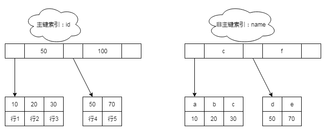

# 索引从入门到精通
作者：阿茂

上回我们说完了InnoDB的架构以及设计原理，现在我们来说一说索引。索引说起来大家应该都不陌生，有没有一种即视感，运维同学在群里甩了一个sql说查询非常慢让开发的同学认领，然后你看到消息会第一反应是不是：条件列没加索引？条件列没吃到现有索引？这类的信息浮现出来？那什么是索引呢？索引具体的工作原理是什么呢？下面我们将逐一展开说明

### 索引的存储结构
索引是优化查询的重要方式之一，它主要在MySQL的存储引擎层实现，每种数据库引擎的索引实现都有一些差异，他们的目的是统一的：在任何情况下最快的找到目标数据。我们列出MySQL存储引擎常用的索引实现：

|索引类型|MyISAM引擎|InnoDB引擎|Memory引擎|
|:----|:----|:----|:----|
|B+Tree索引|支持|支持|支持|
Hash索引|不支持|不支持|支持
R-Tree索引|支持|不支持|不支持
Full-Text索引|支持|不支持|不支持

#### B+Tree索引：
B+Tree索引是通过B+树实现的，是有序排列存储，所以在排序和范围查找方面都比较有优势。那么它是怎么快速找到数据呢？下面我们创建一张表语句如下：
```mysql
create table T(
  id int primary key, 
  name varchar(32) not null,
  age int not null, 
  index (name))engine=InnoDB;
```
1-5行的数据分别是(10,'a',11),(20,'b',13),(30,'c',16),(50,'d',21),(100,'e',33)
那么它用B+Tree索引怎么表示呢：



从上图我们可以看出来
