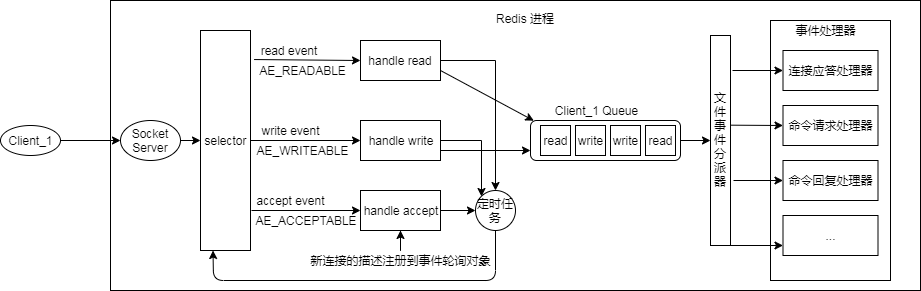

#单线程的Redis为什么那么快？
作者：阿茂

##上期回顾
上一篇文章刚一发出去，就有朋友问我：既然布隆过滤器是概率性的，在极端情况下数据库有的缺被你判没了怎么办？那它的优点是什么？在上一篇文章中确实这种方面说的比较少，这里我就说说我自己的看法吧。首先你使用布隆过滤器判“包含”的时候就存在有损业务数据的可能性，这个也就是需要使用者对自身业务有损的容忍度。我们可以根据上篇文章提到的公式设计一个自己系统能容忍的误判率，就可以了。我们再说说它适合在什么场景使用：还是我们上一篇的推送给用户信息的例子，如果使用常规方式那么你得维护一套持久化的发送对应关系，每次需要查找出未推送的用户，这一步就需要较多的内存或者磁盘资源，如果使用一个误判小于0.1%布隆过滤器的话，也就是可能会存在小于0.1%的用户未收到推送消息，根据业务场景两者相比取最优就可以了。还有对于修改布隆过滤器的操作，为了保证不重置掉别的key至少需要两个以上hash函数。另外，要是把布隆过滤器当做一个整数计数数组使用的话我建议大家可以参考下：Redis HyperLogLog数据类型，它的使用很方便灵活，但原理有点复杂。

## Redis为什么那么快
这一篇我们说一说Redis的单线程设计模式何以让每条指令支持上单机10万的并发的（标准硬件配置下）。首先他是基于纯内存的操作，在寻址过程上要比磁盘快的就不是一个量级。然后就是它的非阻塞线程IO模型，能够将连接请求的吞吐量提升到极致，最后就是它自身的一套简洁的序列化方式。当然它良好的性能不仅限于此，下面我们就来着重说说线程模型，跟序列化方式。
>对于面试官你只要大致说出下面四条就可以了：
>1. 它是纯存内存操作；
>2. 核心是基于非阻塞的IO多路复用机制；
>3. 单线程的设计避免了多线程上下文切换的资源开销；
>4. 简单且解析性能高的序列化协议。

那么对于高级的一点面试现场看我下面详细的道来
### 非阻塞的IO多路复用机制
其实这个它是两个概念，非阻塞IO,事件轮询。这个是典型的Reactor模型
- 非阻塞IO:阻塞和非阻塞很好理解，比如一个read请求要读固定长度的内容，如果没有读够线程就会一直等待新的数据到来或者超时关闭链接，read请求才能够返回，线程才能继续处理。write请求一般是不会阻塞的，除非链接缓冲区已经满了，write请求才会阻塞，直到缓冲区有新的空间才会写完返回。有了非阻塞IO意味着在读写的时候不必阻塞，读写可以瞬间完成后就可以去干别的事情了，能读/写多少是多少。
- 事件轮询（多路复用）：按照上面说的存在一个问题，那就是会存在读写不完整就返回。事件轮询API就用来解决这一问题，提供一个事件轮询API函数select，输入读写描述符read_fds&write_fds,输出与之对应的读写事件，线程拿到对应的事件去处理，如果没有事件就处于阻塞，且阻塞事件不大于timeout时间。处理完成事件后线程继续来轮询，这种循环轮询我们称之为事件循环。
- 定时任务：Redis 的定时任务会记录在一个称为最小堆的数据结构中。这个堆中，最快要执行的任务排在堆的最上方。在每个循环周期，Redis 都会将最小堆里面已经到点的任务立即进行处理。处理完毕后，将最快要执行的任务还需要的时间记录下来，这个时间就是 select 系统调用的 timeout 参数。因为 Redis 知道未来 timeout 时间内，没有其它定时任务需要处理，所以可以安心睡眠 timeout 的时间。
- 指令队列：Redis会将每个客户端套接字都关联一个指令队列。客户端的指令通过队列来排队进行顺序处理，先到先服务。
- 响应队列：Redis 同样也会为每个客户端套接字关联一个响应队列。Redis 服务器通过响应队列来将指令的返回结果回复给客户端。 如果队列为空，那么意味着连接暂时处于空闲状态，不需要去获取写事件，也就是可以将当前的客户端描述符从 write_fds 里面移出来。等到队列有数据了，再将描述符放进去。避免 select 系统调用立即返回写事件，结果发现没什么数据可以写。出这种情况的线程会飙高 CPU。
### 单线程
说到单线程请大家不要怀疑它的的性能，像Node.js，Nginx它们都是高性能的单线程经典应用。所以在使用单线程中间件的时候一定要谨慎使用那些时间复杂度是O(n)的操作，否则会造成严重的卡顿。
### 高性能文本序列化协议RESP(Redis Serialization Protocol)
RESP是一种肉眼可读的文本协议，异常简单性能也不错。我们让你5分钟了解RESP协议：协议将结构数据定义为5种最小单元类型，单元结束统一跟回车换行符（\r\n）

- 单行字符串：以"+"开头，用+hello world\r\n表示。
- 多行字符串: 以"$"开头，用$redis\r\nhello world\r\n表示。当然多行字符串也可以表示单行字符串。NULL值用多行字符串表示，长度写成-1例如：$-1\r\n这样的。空字符也是用多行字符串标示，长度为0：$0\r\n\r\n
- 整数值: 以":"开头 ，用:1024\r\n表示。
- 错误信息: 以"-"开头，-WRONGTYPE Operation against a key holding the wrong kind of value
- 数组：以"*"开头，后跟数组长度。数组 [1,2,3]表示为：*3\r\n:1\r\n:2\r\n:3\r\n

看到了吧，用不到三分钟就完全掌握了他的序列化协议，是不是很简单。

##  Redis一条指令的足迹
最后为了方便大家也读，我这里配上一张图说说一条指令从客户端发出它所经历的过程，画的不够详细，但是大致是这个样子：

这张图可以参照上面关于非阻塞多路复用的概念便于理解。这里我们着重说下事件处理器

- 连接应答处理器：这个处理器用于对连接服务器监听套接字的客户端进行应答。当 Redis 服务器进行初始化的时候，程序会将这个连接应答处理器和服务器监听套接字的 AE_READABLE 事件关联起来，当客户端用connect 函数连接服务器监听套接字的时候，套接字就会产生 AE_READABLE 事件，引发连接应答处理器执行，并执行相应的套接字应答操作。
- 命令请求处理器：这个处理器负责从套接字队列中读入客户端发送的命令请求内容并且在内存中执行。 当客户端通过连接应答处理器成功连接到服务器之后，服务器会将客户端套接字的 AE_READABLE 事件和命令请求处理器关联起来，当客户端向服务器发送命令请求的时候，套接字就会产生 AE_READABLE 事件，引发命令请求处理器执行，并执行相应的套接字读入操作；在客户端连接服务器的整个过程中，服务器都会一直为客户端套接字的 AE_READABLE 事件关联命令请求处理器。
- 命令回复处理器，这个处理器负责将服务器执行命令后得到的命令回复通过套接字返回给客户端。当服务器有命令回复需要传送给客户端的时候，服务器会将客户端套接字的 AE_WRITABLE 事件和命令回复处理器关联起来，当客户端准备好接收服务器传回的命令回复时，就会产生 AE_WRITABLE 事件，引发命令回复处理器执行，并执行相应的套接字写入操作。
### Redis管道
当我们使用客户端对 Redis 进行一次操作时，客户端将请求传送给服务器，服务器处理完毕后，再将响应回复给客户端。这要花费一个网络数据包来回的时间。如果连续执行多条指令，那就会花费多个网络数据包来回的时间。回到客户端代码层面，客户端是经历了写-读-写-读四个操作才完整地执行了两条指令。现在如果我们调整读写顺序，改成写-写-读-读，这两个指令同样可以正常完成。两个连续的写操作和两个连续的读操作总共只会花费一次网络来回，就好比连续的 write操作合并了，连续的 read 操作也合并了一样。客户端通过对管道中的指令列表改变读写顺序就可以大幅节省IO时间。管道中指令越多，效果越好。
### 理解管道本质
write操作只负责将数据写到本地操作系统内核的发送缓冲然后就返回了。剩下的事交给操作系统内核异步将数据送到目标机器。但是如果发送缓冲满了，那么就需要等待缓冲空出空闲空间来。read操作只负责将数据从本地操作系统内核的接收缓冲中取出来就完事了。但是如果缓冲是空的，那么就需要等待数据到来。连续的 write 操作根本就没有耗时，之后第一个 read 操作会等待一个网络的来回开销，然后所有的响应消息就都已经回送到内核的读缓冲了，后续的 read 操作直接就可以从缓冲拿到结果，瞬间就返回了。它并不是服务器的什么特性，而是客户端通过改变了读写的顺序带来的性能的巨大提升。我这里只说了个大概，有兴趣的可以深入了解操作系统层面的。
## 结尾
本章我们大致聊了下Redis的单线程模型的一些东西，我这里描述可能不是很准确，但是大致是这样样子，糊弄下一般的面试官没问题的。因为再说细了很多牵扯到操作系统的一些知识，我怕我自己都讲不好，还是建议大家自己去看下关于管道，关于多路复用非阻塞IO这些概念，都不是新概念，网上资料也很多的。好了这一篇就讲到这里。大家有什么疑问或者有什么错误的地方欢迎讨论。
