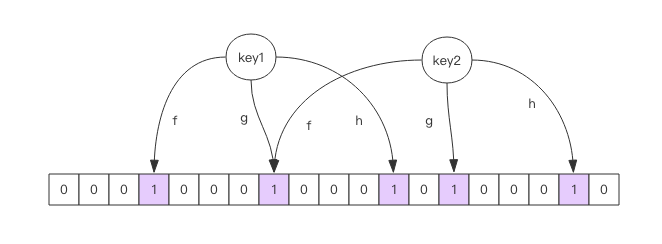

#Redis的缓存雪崩，缓存击穿，热点缓存如何处理？
作者：阿茂

上一篇我们了解了Redis的缓存淘汰策略与算法，相信大家基本对缓存雪崩造成的原因有所了解，这次我们来聊聊出现这些问题我们该如何解决。
## 缓存雪崩
所谓缓存雪崩就是在某一时刻，缓存大量失效，导致大量请求直接打到数据库，给数据库带来巨大的负担。其实在大连缓存在同一时刻失效的时候会伴随着Redis服务卡顿，严重到卡死的现象，这个我们在上一篇：《Redis LRU缓存淘汰机制》中有说道。那么防止缓存雪崩主要的就是要主动控制Redis中key的过期时间，不要让key在同一时间过期，具体做法上篇文章也有说道。还有就是一定防止客户端误操作del,flush等指令导致的缓存大面积失效，这里可以使用命令重写防止高危误操作
>rename-command用于将某些危险的指令修改成特别的名称，用来避免人为误操作。例如：在配置文件的security块增加rename-command flushall "",这样就相当于禁止了flushall的操作，rename-command keys mykeys就相当于需要额外的防止一些默认key扫描。

## 缓存击穿
缓存击穿，总提示有两种，一种是数据库与缓存一致；还有一种是缓存与数据库不一致的情况，下面我们来分别说下两种情况
#### 缓存与数据库一致的缓存击穿
这种缓存击穿的原因就是，在缓存中查不到，直接去查了数据库，数据库也没有，等到下次请求来还会重复这样的操作，当请求量一旦上来就可能拖慢数据库。遇到这样的问题很有可能就是被刻意攻击，或者暴力穷举，处理这种问题我们一般有两种处理办法：

- 回填空值：这种办法是最简单直接且有效的办法，而且不需要引入其他组件，总结下来就是见效快，代价小。需要注意的一点是：一旦数据库有值，需要相对及时的将正确数据回填到缓存，这里给几个建议：可以将数据库更新成功后做一个异步线程或者队列来回填原来的空值。
- 使用布隆过滤器：在4.0以前的版本需要引入三方lib才能使用，是依赖于原来位图的功能来实现的，一次exists需要调用多次getbit指令，相对网络开销就大，比4.0后的性能差太多。使用布隆过滤器重要的点是： 它是概率性的，布隆过滤器中包含的数据库中可能没有，但是布隆过滤中不包含的数据库肯定没有。 后面我会单独带大家学习一下布隆过滤器的原理。
#### 缓存与数据库不一致的缓存击穿
看题目就知道，这种情况就是数据库中有数据，可是在某一时刻，由于缓存中数据过期或者没来得及回填导致大量请求到达数据库。这种情况在一般流量的场景下其实不用关心，只要保证第一次穿透缓存后及时回填数据就可以。下面我们就列举三种处理方式吧

- 缓存预热：比如我们在设计一个秒杀或者报名类的系统，由于活动刚开始后请求量较大，在这之前缓存中从来就没有于此业务相关的缓存存在，会导致访问之初会有大量的缓存数据需要加载到系统中，这样也是很可怕的。这样的情况我们只需要的活动开始前用模拟访问，或者后台线程预先回填的方式将数据缓存起来就能解决。
- 手动阻塞：这种情况比较极端，就是在某一时刻某一些key过期，在第一个请求没回填到缓存中时，就有大量的请求已经达到，这样都会去数据库中做相应的操作。这样的情况，我们就需要在可用性和性能上做出选择。为了保护后端服务或者数据不被压垮，我们一般有两种操作：直接丢弃在后端系统承受范围内的请求，直到回填成功，还有一种就是阻塞处理，当一个或者一部分请求未回填数据之前，其他的请求需要阻塞等待（分布式锁，或者队列等方式），直到第一次的请求回填成功。这种做法就取决你业务数据对系统的容忍程度了，需要根据业务场景仔细考虑。
- 多副本：这种方式就是在上一种情况之上的一个延展，但是对业务代码入侵比较严重，而且需要增加额外的处理逻辑。就是在写入key时会给它同时写入一个同样的备份（同值不同key），然后设置大于原key的过期时间，理论上：备份过期时间>=原key过期时间+回填数据所需的最大耗时，当第一份过期时候主动去查找备份key。这样的做的好处就是解决了阻塞，但是也同样增加Redis内存使用量，而且还要处理在数据回填后保证两个key的值要与数据库的数据一致性。
## 热点缓存
这种问题就更极端了，就是在处理了以上问题以后，Redis已经撑不住对于热key的读写了。那么我们就说说基于这种情况的处理方式

- 加缓存服务器：这句话听起来就像一句废话，但是在条件允许的情况下它是最有效 ，最快速的解决办法
- 缓存降级：当然有的同学说了，我们公司穷没有临时调用的缓存服务器，而且大流量只是瞬时的，一年加起来都没有几个小时，没必要为了这样一个场景去专门做应急服务器呀，不划算。那么这个时候你就要需要征用一些不太重要的缓存服务器来做降级处理，临时支持这部分业务，用完归还。
- 本地缓存：那么又有同学说，我们这里每个服务都重要不能降级，或者我们就一台Redis服务器，所有的业务都用的一个实力，降级也没用。那么这时候就需要分流了，将压力转到应用的本地缓存了。因为本地缓存是在应用上的，只占用应用本身内存和IO不占用Redis存储服务的内存和IO，所有可以给Redis降低不少压力。我们可以使用ehcache这样的本地缓存将一部分热点数据放到应用中，通过网关或者Nginx等直接将一部分请求直接转到应用上让应用来抵挡一部分峰值，当请求不够时我们还可以横向添加应用数量。这样相当于充当了二级缓存，但是一定要注意两层缓存的一致性。而且最好只支持读业务，否则在多处做写操作，保证一致性就更复杂了。
##布隆过滤器
上面我们讲到使用布隆过滤器防止攻击或者类似判断关联关系的业务：判断消息是否推送给用户，是否使用爬虫爬过的网页 等等，用来降低磁盘IO。那么下面我们来讲解一下它的原理：布隆过滤器在Redis里面就是一个大型位数组跟几个无偏hash函数组成（所谓无偏hash就是能够相对的将数据算的比较均匀）。步骤如下，顺便再网上扒了一张图：

1.当一个key添加到布隆过滤器时，使用hash函数对key进行hash得一个整数；
2.将第一步得到的整数对数组长度进行取模，得到的值就是key所在的数组位置；
3.将位置数组位置设为1；
4.使用下一个hash函数重复以上步骤；

在使用查询时，会将传入key分别用hash函数计算出位置，判断对应的位置是否都为1.只要有一个位置为0，那么这个key肯定不存在与过滤器中，如果都为1则这个key并不一定存在，它存在的概率取决于位数据的稀疏程度，稀疏度越低这个key存在的概率就越大。它有个简单的计算公式：
>布隆过滤器有两个参数，第一个是预计元素的数量n，第二个是错误率f，公式根据两个输入得到两个输出：位数组长度i（也就是需要的存储空间bit单位）和hash函数最佳数量k。hash函数的数量也会影响误判率。
                k=0.7*(i/n) #约等于
                f=0.6185^(i/n) 
由公式得出（公式的推导过程见最下方参考文章，有兴趣的可以在数学老师的陪同下观看）：
1.位数组越长(i/n)，错误率f越低；
2：位数组越长(i/n),hash函数需要的最佳数量也就越多，影响计算效率
3：当一个元素平均需要8bit的指纹空间时(i/n=8),错误率约2%，错误率大于10%时，一个元素的平均指纹空间约5bit。错误率为1%时，一个元素的平均指纹空间越10bit。错误率为0.1%时，一个元素的指纹空间约15bit

看了上面的推论，你会想一个元素占15bit，那相对set集合的空间优势是不是就没有那么明显了？这里需要说明的是，set中存储每个元素的内容，而布隆过滤器只存储元素的指纹。元素的内容大小就是字符串的长度，会有多个字节，每个元素只需要一个指针呗set集合来引用，这个指针它不占空间吗？而指纹空间只有接近两个字节。你要是觉得上面的推导太麻烦？没关系，已经有人帮我们写好了工具，只要把参数写进去直接对比结果就好了。比如：Bloom Filter Calculator（链接会附在结尾）,里面还有曲线分析图

> 布隆过滤器详解 :'http://www.cnblogs.com/allensun/archive/2011/02/16/1956532.html'
>Bloom Filter Calculator :'https://hur.st/bloomfilter/'

